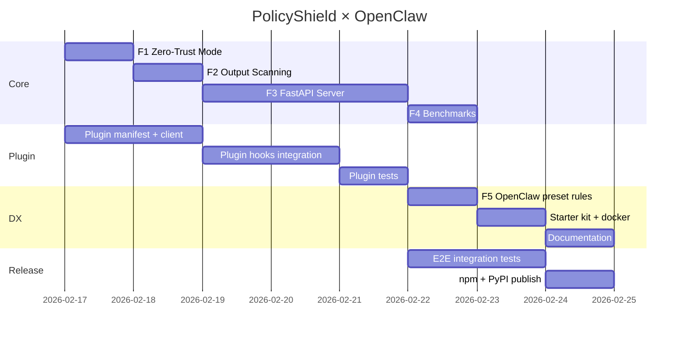

# PolicyShield × OpenClaw: Техническое задание

> **Цель**: любой пользователь OpenClaw может подключить PolicyShield в 3 шага за 5 минут и получить runtime-контроль над tool calls.

---

## Текущее состояние

OpenClaw уже имеет **полноценную plugin-систему** с хуками:

| Хук | Тип | Что может |
|-----|-----|-----------|
| `before_tool_call` | modifying | **блокировать** tool call, **подменять params** |
| `after_tool_call` | void | логировать результат, триггерить alerts |
| `before_agent_start` | modifying | **вставлять текст в system prompt** |
| `session_start` / `session_end` | void | инициализировать/финализировать сессию |

Возврат `before_tool_call`:
```typescript
{ block: true, blockReason: "PII detected" }     // → BLOCK
{ params: { text: "john@***.com" } }              // → REDACT
// return undefined                                // → ALLOW
```

Это **идеально** ложится на PolicyShield: BLOCK → `{ block: true }`, REDACT → `{ params: modified }`, ALLOW → `undefined`.

---

## Архитектура

```
┌─────────────────────────────────────────┐
│  OpenClaw (Node.js)                     │
│  ┌───────────────────────────────────┐  │
│  │ openclaw-plugin-policyshield      │  │
│  │ (npm package, TypeScript)         │  │
│  │                                   │  │
│  │  before_tool_call ──► HTTP POST   │──┼──► PolicyShield Server (Python)
│  │  after_tool_call  ──► HTTP POST   │  │    ├── rules.yaml
│  │  before_agent_start ──► GET       │  │    ├── PII detector
│  └───────────────────────────────────┘  │    ├── rate limiter
│                                         │    ├── session manager
└─────────────────────────────────────────┘    └── audit trail
```

Два компонента:
1. **OpenClaw Plugin** (TypeScript, npm) — тонкий HTTP-клиент, регистрирует хуки
2. **PolicyShield Server** (Python, pip/docker) — engine с правилами, PII, audit

---

## User Experience

### Установка (3 шага)

```bash
# 1. Установить plugin в OpenClaw
openclaw plugin install openclaw-plugin-policyshield

# 2. Запустить PolicyShield server
pip install policyshield
policyshield server --port 8100

# 3. Настроить и всё
```

Или через Docker (ещё проще):

```bash
# docker-compose.yml уже в репо
docker compose up -d policyshield
openclaw plugin install openclaw-plugin-policyshield
```

### Конфигурация

В `openclaw.yaml` (или через UI):

```yaml
plugins:
  policyshield:
    url: http://localhost:8100     # куда стучать (по-умолчанию)
    rules: ./policyshield.yaml    # или URL к правилам
    mode: enforce                 # enforce | audit | disabled
    fail_open: true               # при недоступности сервера
```

### Пример rule-файла

```yaml
shield_name: my-openclaw-policy
version: 1
default_verdict: allow

rules:
  - id: block-rm-rf
    tool: exec
    when:
      args:
        command: { contains: "rm -rf" }
    then: block
    message: "Destructive filesystem operations are prohibited"

  - id: redact-pii-everywhere
    tool: "*"
    when:
      args:
        _any: { has_pii: true }
    then: redact
    message: "PII detected and redacted"

  - id: approve-sensitive-writes
    tool: write
    when:
      args:
        file_path: { regex: "\\.(env|key|pem)$" }
    then: approve
    message: "Writing to sensitive files requires approval"
```

---

## Компонент 1: OpenClaw Plugin (TypeScript)

### 1.1 Manifest

```json
// openclaw.plugin.json
{
  "id": "policyshield",
  "name": "PolicyShield",
  "description": "Runtime policy enforcement for AI agent tool calls",
  "version": "0.1.0",
  "configSchema": {
    "type": "object",
    "properties": {
      "url": {
        "type": "string",
        "default": "http://localhost:8100",
        "description": "PolicyShield server URL"
      },
      "mode": {
        "type": "string",
        "enum": ["enforce", "audit", "disabled"],
        "default": "enforce"
      },
      "fail_open": {
        "type": "boolean",
        "default": true,
        "description": "Allow tool calls when PolicyShield server is unreachable"
      },
      "timeout_ms": {
        "type": "number",
        "default": 5000,
        "description": "HTTP timeout for PolicyShield server"
      }
    }
  }
}
```

### 1.2 Хуки

```typescript
// src/index.ts
import type {
  PluginHookBeforeToolCallEvent,
  PluginHookBeforeToolCallResult,
  PluginHookToolContext,
  PluginHookAfterToolCallEvent,
  PluginHookBeforeAgentStartEvent,
  PluginHookBeforeAgentStartResult,
  PluginHookAgentContext,
} from "openclaw/plugins/types";

type ShieldVerdict = {
  verdict: "ALLOW" | "BLOCK" | "REDACT" | "APPROVE";
  message: string;
  modified_args?: Record<string, unknown>;
  rule_id?: string;
  pii_types?: string[];
};

export default function register(ctx: { config: PluginConfig }) {
  const client = new PolicyShieldClient(ctx.config);

  return {
    hooks: [
      // ---- Pre-check: block or modify params ----
      {
        hookName: "before_tool_call" as const,
        priority: 100,  // run before other plugins
        async handler(
          event: PluginHookBeforeToolCallEvent,
          toolCtx: PluginHookToolContext,
        ): Promise<PluginHookBeforeToolCallResult | undefined> {
          const verdict = await client.check({
            tool_name: event.toolName,
            args: event.params as Record<string, unknown>,
            session_id: toolCtx.sessionKey ?? "default",
            sender: toolCtx.agentId,
          });

          if (verdict.verdict === "BLOCK") {
            return { block: true, blockReason: `🛡️ ${verdict.message}` };
          }
          if (verdict.verdict === "REDACT") {
            return { params: verdict.modified_args };
          }
          if (verdict.verdict === "APPROVE") {
            // For now, block with approval message.
            // TODO: integrate with OpenClaw's exec-approval flow
            return { block: true, blockReason: `⏳ ${verdict.message}` };
          }
          return undefined; // ALLOW
        },
      },

      // ---- Post-check: audit + PII scan output ----
      {
        hookName: "after_tool_call" as const,
        priority: 100,
        async handler(
          event: PluginHookAfterToolCallEvent,
          toolCtx: PluginHookToolContext,
        ): Promise<void> {
          await client.postCheck({
            tool_name: event.toolName,
            args: event.params as Record<string, unknown>,
            result: event.result,
            session_id: toolCtx.sessionKey ?? "default",
          });
        },
      },

      // ---- System prompt enrichment ----
      {
        hookName: "before_agent_start" as const,
        priority: 50,
        async handler(
          _event: PluginHookBeforeAgentStartEvent,
          _ctx: PluginHookAgentContext,
        ): Promise<PluginHookBeforeAgentStartResult | undefined> {
          const constraints = await client.getConstraints();
          if (!constraints) return undefined;
          return {
            prependContext: `\n## PolicyShield Active Rules\n${constraints}\n`,
          };
        },
      },
    ],
  };
}
```

### 1.3 HTTP Client

```typescript
// src/client.ts
class PolicyShieldClient {
  private url: string;
  private timeout: number;
  private mode: string;
  private failOpen: boolean;

  constructor(config: PluginConfig) {
    this.url = config.url ?? "http://localhost:8100";
    this.timeout = config.timeout_ms ?? 5000;
    this.mode = config.mode ?? "enforce";
    this.failOpen = config.fail_open ?? true;
  }

  async check(req: CheckRequest): Promise<ShieldVerdict> {
    if (this.mode === "disabled") {
      return { verdict: "ALLOW", message: "" };
    }
    try {
      const res = await fetch(`${this.url}/api/v1/check`, {
        method: "POST",
        headers: { "Content-Type": "application/json" },
        body: JSON.stringify(req),
        signal: AbortSignal.timeout(this.timeout),
      });
      const verdict = await res.json() as ShieldVerdict;
      if (this.mode === "audit") {
        // Log but don't enforce
        console.log(`[policyshield:audit] ${verdict.verdict}: ${verdict.message}`);
        return { verdict: "ALLOW", message: "" };
      }
      return verdict;
    } catch (err) {
      if (this.failOpen) {
        console.warn(`[policyshield] server unreachable, fail-open: ${err}`);
        return { verdict: "ALLOW", message: "" };
      }
      return { verdict: "BLOCK", message: "PolicyShield server unreachable" };
    }
  }

  async postCheck(req: PostCheckRequest): Promise<void> {
    try {
      await fetch(`${this.url}/api/v1/post-check`, {
        method: "POST",
        headers: { "Content-Type": "application/json" },
        body: JSON.stringify(req),
        signal: AbortSignal.timeout(this.timeout),
      });
    } catch { /* fire and forget */ }
  }

  async getConstraints(): Promise<string | undefined> {
    try {
      const res = await fetch(`${this.url}/api/v1/constraints`, {
        signal: AbortSignal.timeout(2000),
      });
      const data = await res.json() as { summary: string };
      return data.summary;
    } catch { return undefined; }
  }
}
```

### 1.4 Deliverable

- npm-пакет: `openclaw-plugin-policyshield`
- Устанавливается: `openclaw plugin install openclaw-plugin-policyshield`
- Ноль зависимостей кроме `fetch` (Node.js built-in)

**Effort**: M (3-4 дня)

---

## Компонент 2: PolicyShield Server (Python)

### 2.1 FastAPI server

`policyshield server` — новая CLI-команда, запускает HTTP API поверх существующего `ShieldEngine`.

```python
# policyshield/server/app.py
from fastapi import FastAPI
from policyshield.shield.engine import ShieldEngine

app = FastAPI(title="PolicyShield")

@app.post("/api/v1/check")
async def check(req: CheckRequest) -> CheckResponse:
    result = engine.check(
        tool_name=req.tool_name,
        args=req.args,
        session_id=req.session_id,
        sender=req.sender,
    )
    return CheckResponse(
        verdict=result.verdict.value,
        message=result.message,
        modified_args=result.modified_args,
        rule_id=result.rule_id,
        pii_types=[m.pii_type.value for m in result.pii_matches],
    )

@app.post("/api/v1/post-check")
async def post_check(req: PostCheckRequest) -> PostCheckResponse:
    result = engine.post_check(
        tool_name=req.tool_name,
        args=req.args,
        result_text=req.result,
        session_id=req.session_id,
    )
    return PostCheckResponse(
        pii_types=[m.pii_type.value for m in result.pii_matches],
        redacted_output=result.redacted_output,
    )

@app.get("/api/v1/constraints")
async def constraints() -> ConstraintsResponse:
    return ConstraintsResponse(summary=engine.get_policy_summary())

@app.get("/api/v1/health")
async def health():
    return {"status": "ok", "rules_count": len(engine.rules), "mode": engine.mode.value}
```

### 2.2 CLI

```bash
policyshield server \
  --rules ./rules.yaml \
  --port 8100 \
  --mode enforce \
  --host 0.0.0.0
```

### 2.3 Docker

```dockerfile
FROM python:3.12-slim
RUN pip install policyshield[server]
COPY rules.yaml /app/rules.yaml
CMD ["policyshield", "server", "--rules", "/app/rules.yaml", "--port", "8100"]
EXPOSE 8100
```

### 2.4 Зависимости

```toml
# pyproject.toml
[project.optional-dependencies]
server = ["fastapi>=0.100", "uvicorn[standard]>=0.20"]
```

**Effort**: M (3-4 дня)

---

## Компонент 3: Starter Kit

### 3.1 `policyshield init --preset openclaw`

Генерирует:
```
./policyshield.yaml          # rules для типичного OpenClaw use-case
./docker-compose.yml          # policyshield server
```

### 3.2 Preset правила для OpenClaw

```yaml
shield_name: openclaw-default
version: 1
default_verdict: allow

rules:
  # ── Safety ──
  - id: block-destructive-commands
    tool: exec
    when:
      args:
        command: { regex: "\\b(rm -rf|mkfs|dd if=|chmod 777|curl.*\\|.*sh)\\b" }
    then: block
    severity: critical
    message: "Destructive command blocked"

  - id: block-secrets-exfil
    tool: exec
    when:
      args:
        command: { regex: "\\b(curl|wget|nc|scp)\\b.*\\b(AWS_SECRET|OPENAI_API_KEY|password|token)\\b" }
    then: block
    severity: critical
    message: "Potential secrets exfiltration blocked"

  # ── PII ──
  - id: redact-pii-in-messages
    tool: message
    when:
      args:
        _any: { has_pii: true }
    then: redact
    message: "PII detected in message, redacting"

  - id: redact-pii-in-writes
    tool: write
    when:
      args:
        content: { has_pii: true }
    then: redact
    message: "PII detected in file write, redacting"

  # ── Approval ──
  - id: approve-dotenv-writes
    tool: write
    when:
      args:
        file_path: { regex: "\\.(env|pem|key)$" }
    then: approve
    message: "Writing to sensitive file requires approval"

  # ── Rate limit ──
  - id: rate-limit-exec
    tool: exec
    rate_limit:
      max_calls: 50
      window_seconds: 60
    then: block
    message: "exec rate limit exceeded (50/min)"
```

### 3.3 Docker Compose

```yaml
services:
  policyshield:
    image: ghcr.io/mishabar/policyshield:latest
    ports:
      - "8100:8100"
    volumes:
      - ./policyshield.yaml:/app/rules.yaml:ro
    environment:
      POLICYSHIELD_MODE: enforce
    restart: unless-stopped
```

**Effort**: S (1-2 дня)

---

## Фичи PolicyShield Server (доработки)

Ниже — что нужно добавить/доработать в Python-ядре для полноценной работы с OpenClaw.

### F1. Zero-Trust Mode (default-deny)

**GAP**: `base_engine.py:145` — unmatched tool call → ALLOW.

**FIX**: добавить `default_verdict` в `RuleSet`, использовать в engine.

```python
if match is None:
    if self._ruleset.default_verdict == Verdict.BLOCK:
        return ShieldResult(verdict=Verdict.BLOCK, rule_id="__default_deny__",
                            message=f"No rule matched for '{tool_name}'. Default: BLOCK.")
    return self._verdict_builder.allow(args=args)
```

**Effort**: S (0.5 дня)

---

### F2. Output Scanning (post-call PII)

**GAP**: `post_check()` записывает trace, но не маскирует PII в output.

**FIX**: `post_check()` возвращает `PostCheckResult` с `redacted_output`.

```python
class PostCheckResult(BaseModel):
    pii_matches: list[PIIMatch] = []
    redacted_output: str | None = None
```

Плагин OpenClaw получает `redacted_output` и может подставить в `tool_result_persist` hook.

**Effort**: S (1 день)

---

### F3. HTTP API (FastAPI server)

**GAP**: нет HTTP-сервера.

**FIX**: `policyshield server` CLI-команда + FastAPI app (описан выше).

**Effort**: M (2-3 дня)

---

### F4. Performance (< 5ms p99)

**GAP**: нет бенчмарков.

**FIX**: Benchmark suite + CI gate.

| Scenario | Target p99 |
|---|---|
| ALLOW, 10 rules | < 0.5ms |
| BLOCK + PII scan, 10 rules | < 3ms |
| REDACT + masking, 10 rules | < 5ms |

**Effort**: S (1 день)

---

### F5. OpenClaw Preset Rules

**GAP**: нет ready-to-use rules для OpenClaw tools (`exec`, `write`, `read`, `message`, etc.).

**FIX**: `policyshield init --preset openclaw` (описан выше).

**Effort**: S (0.5 дня)

---

## План реализации



| # | Что | Effort | Приоритет |
|---|-----|--------|-----------|
| P1 | OpenClaw Plugin (npm) | M (4 дня) | **P0** |
| F3 | FastAPI Server (Python) | M (3 дня) | **P0** |
| F1 | Zero-Trust Mode | S (0.5 дня) | **P0** |
| F5 | Preset Rules | S (0.5 дня) | **P0** |
| F2 | Output Scanning | S (1 день) | **P1** |
| F4 | Benchmarks | S (1 день) | **P1** |
| DX | Starter Kit + Docs | S (2 дня) | **P1** |

**Total: ~13 дней до release**

---

## Что НЕ входит в scope v1

- ❌ Переписывание PolicyShield на TypeScript (Python engine работает как sidecar)
- ❌ Semantic PII (NER) — оставляем regex L0, достаточно для MVP
- ❌ Cross-tool conditional chaining — advanced, после v1
- ❌ Cost tracking — после v1
- ❌ Nanobot / LangChain / CrewAI интеграции — уже есть, не трогаем
